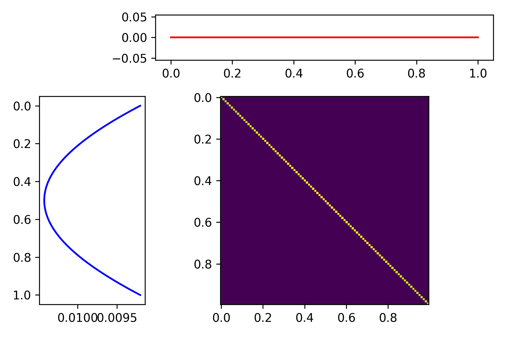
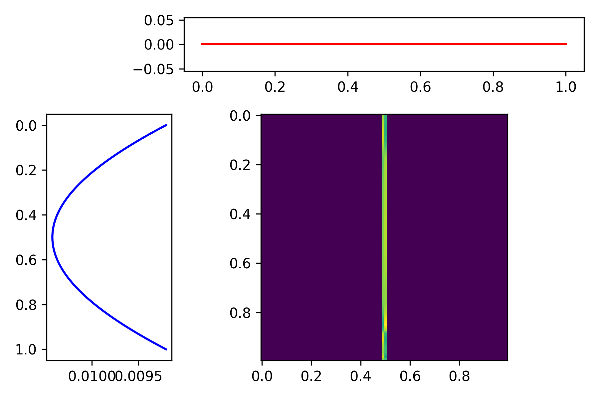
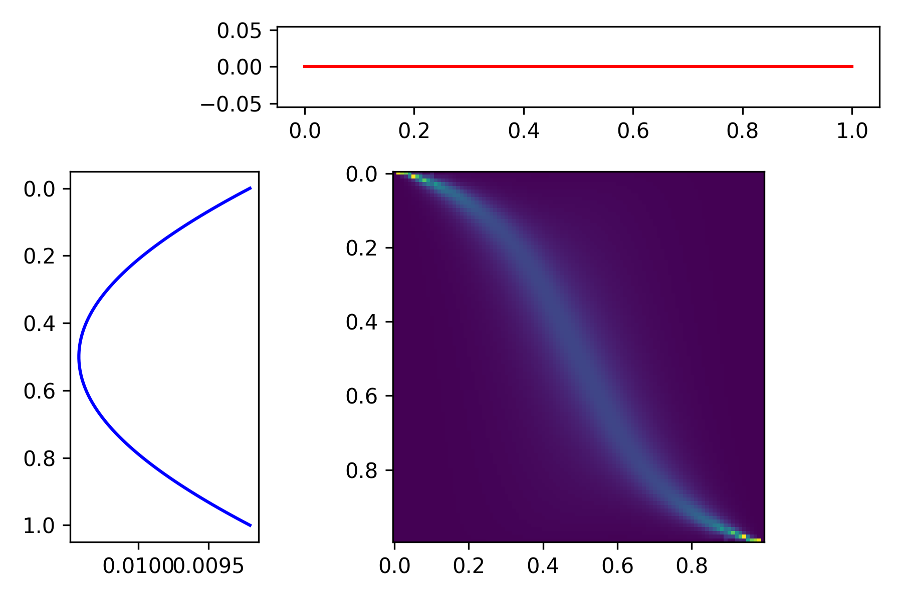

# BayesLP

The notebook <code>Bayes_LP.ipynb</code> uses the connection made between optimal transport and Bayesian Persuasion in  [Kolotilin (2018)][1] to identify and visualize optimal information mechanisms.
* Please see the paper or the slides <code>slides/kolotilin_slides.pdf</code> for details concerning the communication game of the paper.

The linear programming approach in this paper, under certain circumstances, allows us to explicitly compute optimal mechanisms as the solution of a transportation problem in situations where concavification does not easily generate a concrete solution.

* In the standard optimal transport setting, the objective is to minimize the cost from moving the mass of one probability measure to another.
    * Specifically, to minimize a cost functional of a joint distribution, in which the marginal distributions in the source and target spaces match a given source and target distributions.

* In the Bayesian Persuasion setting, the sender is choosing a joint distribution (implicitly a Blackwell experiment) between states and messages.
    * The marginal distribution with respect to the state space must match the prior distribution (Bayes plausibility).
    * In addition, the marginal with respect to the message space must satisfy an incentive compatibility or an "obedience" constraint in terms of the receiver's utility.
    * Messages in the Kolotilin model are interpreted as action recommendations, and the receiver must be made indifferent when performing the recommended action (conditional on the message).

Here is the optimal mechanism when the sender's (state-independent) utility is the square of the message/receiver's action:

The top panel illustrates the incentive compatibility constraint for the message space, the right panel describes the prior distribution, and the center panel is the optimal joint distribution. As mentioned in this paper and in the original [Kamenica-Gentzkow (2011)][2] paper, the optimal experiment is full revelation when the sender's state-independent utility is a convex function of the posterior, which is found here.

Here is the optimal mechanism when the sender's utility is the square root of the message/receiver's action:

Not surprisingly, the optimal experiment is completely uninformative, since the sender's utility is a concave function of the posterior.

Finally, here is the optimal mechanism when the sender's utility is linear in the message/receiver's action, which is both concave and convex:

This demonstrates the usefulness of the Kolotilin model for calculating the optimal experiment in settings where it is not obvious what the optimal experiment should be. Note that since this notebook uses a discretization of the model, the utility functions for the receiver and the sender need not strictly satisfy the continuity assumptions used in his paper.

[1]: <https://onlinelibrary.wiley.com/doi/abs/10.3982/TE1805> "Optimal information disclosure: A linear programming approach."
[2]: <https://www.aeaweb.org/articles?id=10.1257/aer.101.6.2590> "Bayesian Persuasion."
